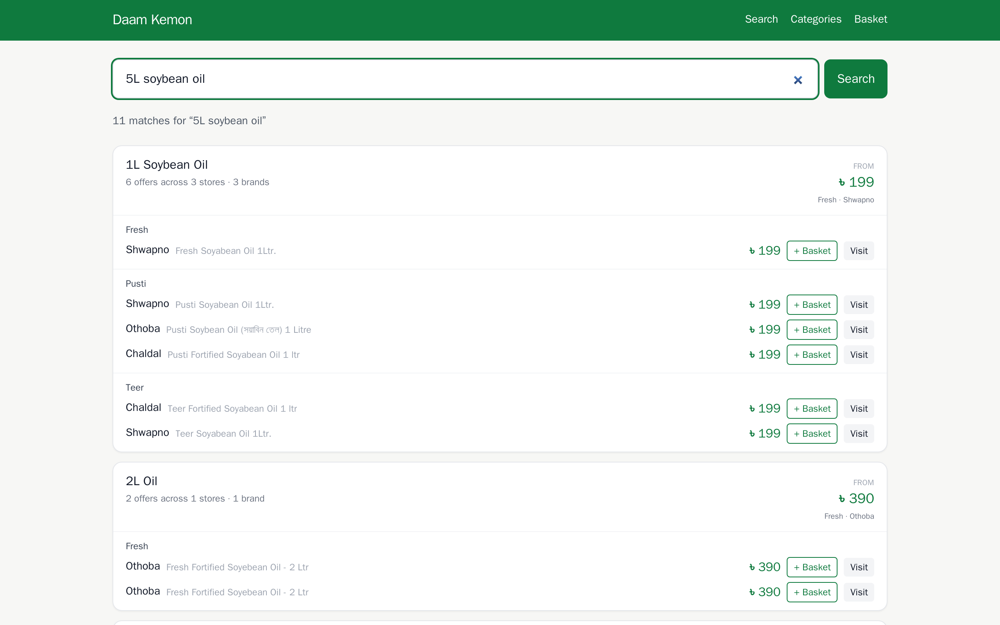
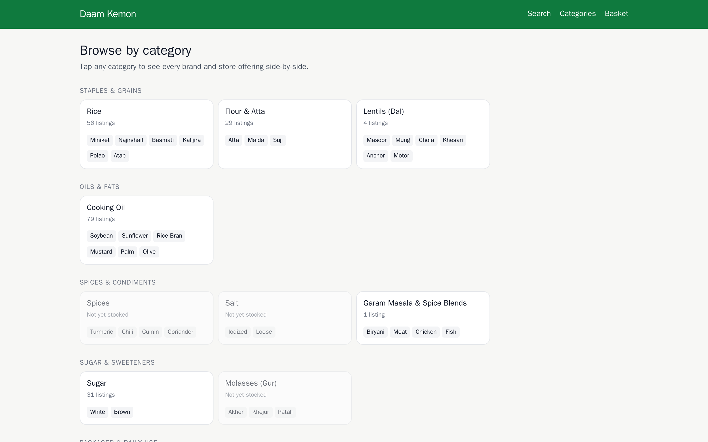
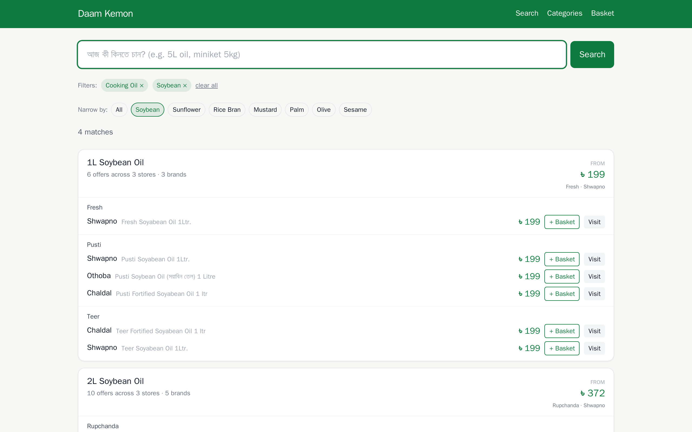

# Daam Kemon

> A grocery price intelligence engine for Bangladesh. Scrapes Chaldal,
> Shwapno, Othoba, Unimart and Daraz daily, normalizes messy Bangla+English listings
> into a canonical catalog using a tiered confidence-scoring matcher, then
> aggregates by **(oil type + size)** so a shopper sees `5L Soybean Oil` as one
> row across every brand and every store — sorted cheapest first.



> 13 offerings across 3 stores and 5 brands, all grouped under one bucket.
> Cheapest highlighted; brand becomes a row attribute, not a separate group.

<details>
<summary>More screenshots — categories browse, filtered search, basket optimizer</summary>

|  |  |
|---|---|
| **Browse by category** | **Filter to one subcategory** |
|  |  |

</details>

```
┌── 5L Soybean Oil ────────────────────  from ৳ 890 (Fresh · Shwapno) ──┐
│                                                                       │
│  Fresh                                                                │
│    Shwapno · Fresh Soybean Oil 5 Litre   ৳ 890  [+ Basket] [Visit]   │
│    Chaldal · Fresh Soyabean Oil (5L)     ৳ 905                       │
│  Teer                                                                 │
│    Shwapno · Teer Soybean Oil 5L         ৳ 900                       │
│    Chaldal · Teer Soyabean Oil 5 Litre   ৳ 910                       │
│  Rupchanda                                                            │
│    Shwapno · Rupchanda Soybean Oil 5L    ৳ 905                       │
│    …                                                                  │
└───────────────────────────────────────────────────────────────────────┘
```

Beyond search, a **basket optimizer** computes the cheapest single store and
an optimal multi-store split — including each store's tiered delivery fees —
for the user's whole shopping list.

---

## Why this exists

Bangladeshi grocery shoppers don't pick between "Rupchanda 5L oil" and
"Fresh 5L oil" — they pick between **5L of soybean oil from whoever's
cheapest**. Existing comparison tools (built mostly for electronics) group by
exact-product-match, which misses 90% of grocery shopping behavior. Daam Kemon
solves the actual problem:

- **Match across messy listings**: `"রূপচাঁদা সয়াবিন তেল ৫ লিটার"` and
  `"Rupchanda Soyabean Oil 5 Litre"` collapse to the same canonical product.
- **Group by what shoppers care about**: oil type and quantity. Brand and
  store are rows inside the bucket, not separate buckets.
- **Optimize the whole cart**: 30+ BDT savings threshold for split-store
  recommendations because dealing with two deliveries below that is not
  worth it.

---

## Stack

- **Backend**: Python 3.11, FastAPI, SQLAlchemy (async), PostgreSQL 16 with
  `pg_trgm`, APScheduler
- **Scrapers**: Playwright + Chromium, one module per store with selectors
  isolated as top-of-file constants
- **Frontend**: Next.js 14 (App Router) + Tailwind CSS, mobile-first
- **Infra**: Docker Compose, single image for api + scheduler

---

## Architecture at a glance

```
┌─────────────┐    ┌──────────────────────────┐    ┌────────────┐
│  Next.js    │───▶│   FastAPI                │───▶│ Postgres   │
│  /search    │    │   /search /basket        │    │ pg_trgm    │
│  /basket    │◀───│   /categories /admin/*   │◀───│ products,  │
│  /categories│    │                          │    │ listings,  │
└─────────────┘    └──────────────────────────┘    │ price_hist │
                              ▲                    └────────────┘
                              │                          ▲
                   ┌──────────────────────┐              │
                   │  daily scrape (CI)   │──────────────┘
                   │  ├ chaldal  ├ unimart│
                   │  ├ shwapno  └ daraz  │   normalize → match
                   │  └ othoba            │   → upsert + history
                   └──────────────────────┘
```

Production scraping runs **once a day** via a GitHub Actions cron
(`.github/workflows/scrape.yml`, 01:00 UTC), which writes straight to the
production database. The in-repo APScheduler (`backend/scrapers/scheduler.py`,
every `SCRAPE_INTERVAL_HOURS`, default 6h) is the **local / self-hosted** data
path and is disabled on the hosted deployment (`ENABLE_SCHEDULER=false`).

The interesting code:

| File | What it does |
|---|---|
| `backend/app/core/normalizer.py` | Bangla/English listing string → structured `NormalizedProduct` (category, subcategory, brand, size, base_unit_qty, loose flag) |
| `backend/app/core/matcher.py` | 5-tier confidence-scoring match (exact / brand / category / loose / fuzzy) |
| `backend/app/core/basket_optimizer.py` | Brute-force optimal split over `2^N − 1` store subsets, with tiered delivery fees |
| `backend/app/services/search_service.py` | Search + per-(subcategory, size) bucket aggregation |
| `backend/scrapers/{chaldal,shwapno,othoba}.py` | Per-store scrapers, selectors as constants |
| `backend/scrapers/scheduler.py` | APScheduler container for local/self-host — every 6h scrape, daily stale-listing cleanup (disabled in the hosted deploy; production scrapes daily via GitHub Actions) |

---

## Design decisions

A few choices that aren't obvious from the code:

- **Per-brand canonicals + aggregation at search time, not a flat product
  table.** Each `(brand, subcategory, size)` is its own canonical row in
  `products`. The aggregation collapses them by `(subcategory, size)` only at
  read time. This means: ingest stays brand-strict (so unknown brands don't
  silently latch onto a famous one's canonical), but the UI shows the shopping
  view a user actually wants. Best of both worlds.

- **Category-tier match is brand-strict on ingest, brand-tolerant on search.**
  Ingest threshold is 0.85 (BRAND tier or better), search uses the full 0.70+
  tiers. Without this split, scraping `"Pusti Soybean 5L"` would attach the
  listing to the `Rupchanda Soybean 5L` canonical because they share size +
  subcategory. We discovered this the day we deployed; the regression test in
  `tests/test_matcher.py::test_category_tier_does_not_cross_brands` is from
  that bug.

- **Scraper selectors live as constants at the top of each file.** When a
  store redesigns (which happens), the patch is one line. There's also
  `scrapers/_probe.py` — a small Playwright reconnaissance script — so the
  next selector change takes 5 minutes, not an afternoon.

- **Brute-force split, not ILP.** With 3 stores and ~20 basket items there
  are only 7 non-empty subsets to evaluate; the brute force is exact, fast,
  and obvious. If we ever scale to 10+ stores it becomes an integer program.

- **Loose goods are first-class.** Sugar, rice and dal sold loose by the kg
  are separate canonical rows from their packaged equivalents. They're not
  the same shopping decision — a shopper considering "1kg loose sugar 122
  BDT" vs "1kg City Sugar 130 BDT" is choosing between two real options.

- **Cloudflare RocketLoader workaround for Othoba.** Othoba serves empty
  `<ins>` price placeholders that JS fills in after deferred loading. The
  scraper uses `wait_for_function` until at least one `Tk <num>` appears
  before extracting — otherwise we'd get 40 cards with 0 prices.

---

## Folder structure

```
daamkemon/
├── backend/
│   ├── app/
│   │   ├── main.py             FastAPI entry
│   │   ├── api/                /search /products /basket /stores /click
│   │   │                       /admin/{scrape_runs,freshness} /categories
│   │   ├── models/             SQLAlchemy: Product, StoreProduct,
│   │   │                       PriceHistory, Store, Basket, ScrapeRun, …
│   │   ├── schemas/            Pydantic response models
│   │   ├── services/           search + basket orchestration
│   │   └── core/
│   │       ├── categories.py       BD-grocery vocabulary (29 categories, 9 groups)
│   │       ├── normalizer.py       messy listing → NormalizedProduct
│   │       ├── matcher.py          tiered confidence-scoring match()
│   │       └── basket_optimizer.py single-store + optimal-split
│   ├── scrapers/
│   │   ├── base.py             Playwright lifecycle, retry, rate limit
│   │   ├── chaldal.py
│   │   ├── shwapno.py
│   │   ├── othoba.py
│   │   ├── runner.py           scrape → normalize → match → upsert + history
│   │   ├── scheduler.py        APScheduler: every 6h + daily cleanup
│   │   └── _probe.py           selector reconnaissance tool
│   ├── seed/seed_data.py       hand-curated MVP bootstrap (replaced by scrapers)
│   ├── migrations/001_initial.sql
│   └── tests/                  unit tests: normalizer, matcher, optimizer
├── frontend/
│   ├── app/                    /, /search, /categories, /basket
│   ├── components/             SearchBar, AggregatedGroup, PriceComparison
│   └── lib/                    api client, basket store (localStorage)
└── docker-compose.yml
```

---

## Setup

### Quick start (Docker)

```bash
docker compose up --build -d db
# wait a few seconds for Postgres + migrations
docker compose run --rm api python -m seed.seed_data
docker compose up -d api web scheduler
```

Open <http://localhost:3000>. The scheduler kicks an immediate scrape on
startup; first real data lands in 2–6 minutes depending on which categories
you've enabled per store.

### Local dev (without Docker)

```bash
# Postgres + Redis
docker run -d -p 5432:5432 -e POSTGRES_DB=daamkemon -e POSTGRES_USER=daamkemon \
  -e POSTGRES_PASSWORD=daamkemon postgres:16-alpine

# Backend
cd backend
python -m venv .venv && source .venv/bin/activate
pip install -r requirements.txt
playwright install chromium
psql -h localhost -U daamkemon -d daamkemon -f migrations/001_initial.sql
python -m seed.seed_data
uvicorn app.main:app --reload

# Frontend
cd frontend
npm install
npm run dev
```

API: <http://localhost:8000/docs> · Web: <http://localhost:3000>

### Running the scrapers manually

```bash
docker compose run --rm api python -m scrapers.runner --store all
# or just one category on one store:
docker compose run --rm api python -m scrapers.runner --store chaldal --categories cooking_oil rice
```

### Tests

```bash
cd backend
pytest
```

The tests cover the parts that actually need to be right — normalizer,
matcher (with regression tests for both subcategory-cross and brand-cross
bugs we hit live), and basket optimizer. No DB required.

---

## How the matching engine works

1. **Normalize** — `app/core/normalizer.py` turns a raw listing string
   (English or Bangla, with messy units, packaging noise, etc.) into a
   structured `NormalizedProduct` with: category, subcategory, brand, size
   value + canonical unit, base unit quantity (ml/g/pcs), loose flag.
2. **Match** — `app/core/matcher.py` compares the normalized product against
   canonical products in the same category and returns the best tier:

   | Tier      | Confidence | When |
   |-----------|-----------:|------|
   | exact     | 1.00       | same brand + same subcategory + same size + same canonical unit |
   | brand     | 0.85       | same brand + same subcategory + same base quantity (units differ) |
   | category  | 0.70       | same subcategory + same size; brands compatible (both None, both same, or one None) |
   | loose     | 0.55       | loose-goods bucket, same subcategory + size |
   | fuzzy     | 0.50       | trigram name similarity ≥ 0.75 with matching size and compatible brands |
   | unmatched | 0.00       | nothing fit |

3. **Persist** — the scraper runner uses the matcher to find a canonical
   product. **Ingest threshold is 0.85** (brand-confident or better). Below
   that, a new canonical is created — fragmenting more, but never leaking
   brand attribution. Search uses the full 0.70+ tier set to be more
   tolerant. Every listing stores its `match_confidence` and `match_method`
   so the UI can flag "best-effort" comparisons.

---

## How basket optimization works

`app/core/basket_optimizer.py`:

- For each item, collect every in-stock store offering.
- Compute a per-store plan: items at that store + applicable delivery fee.
- **Best single store**: cheapest store that fulfills the whole basket (or
  the closest partial fulfillment if no store has everything).
- **Optimal split**: brute force over all `2^N − 1` non-empty subsets of
  stores. With N = 3 this is 7 combinations — exact and fast.
- A split is **only surfaced when savings ≥ 30 BDT** — pocket-change savings
  aren't worth dealing with two deliveries.

---

## Monetization (hooks only)

- `stores.affiliate_config` (JSONB) holds an optional `redirect_template`
  string. The `/click/{store_product_id}` endpoint wraps outbound URLs
  through it if present, logs the click into `outbound_clicks`, and
  302-redirects.
- `store_products.raw.sponsored` (boolean) drives a clearly-labeled
  "sponsored" badge in the UI. **No ranking changes** — sponsored listings
  still compete on price.

Scaffolding only; full attribution and billing belong in a separate service.

---

## What's deliberately out of scope (and where it would go)

- **Auth + saved baskets** — `baskets.user_id` field exists; client currently
  stores in localStorage.
- **Price drop notifications** — `price_history` is appended on every change;
  a Redis stream + cron job would feed an email/SMS worker.
- **More stores** — each scraper is ~150 lines and one selector-probe session.
- **Embedding-based matcher for the long tail** — current matcher is rule-based
  and tested; embeddings would help for niche categories where the brand
  vocabulary is sparse.
- **Catalog admin UI** for manual product merges.
- **Sub-daily refresh** — production currently scrapes once a day (GitHub
  Actions cron → managed Postgres on Supabase; API on Render, frontend on
  Vercel). docker-compose covers local dev, where the APScheduler container can
  run every 6h. Tightening the hosted cadence below daily would mean more CI
  minutes and more load on the stores — a deliberate trade, not a gap.

---

## License

MIT — see [LICENSE](LICENSE).
